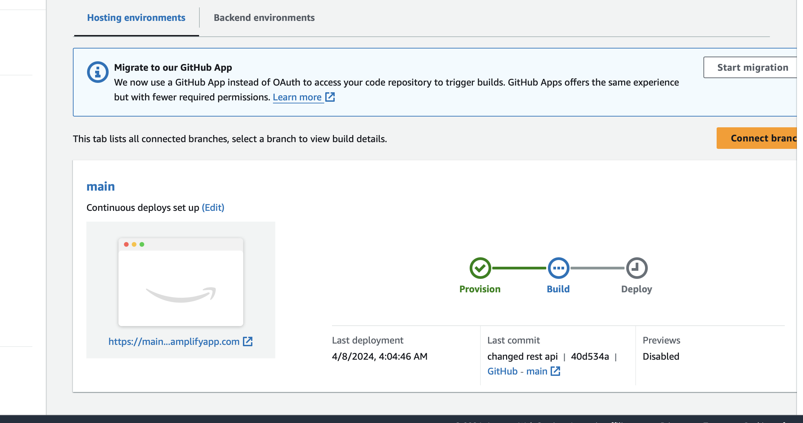
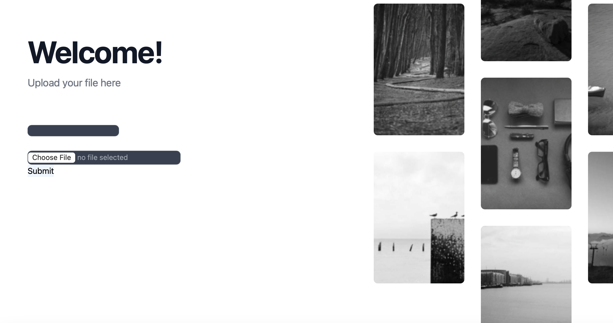
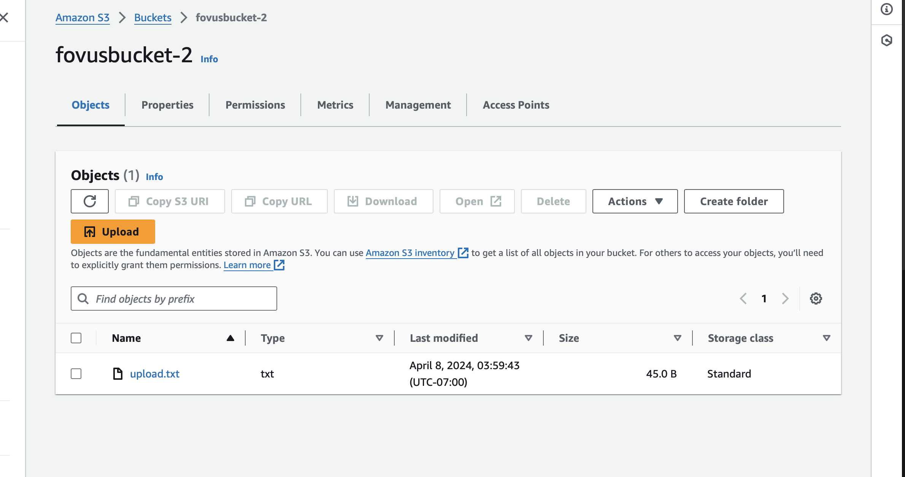
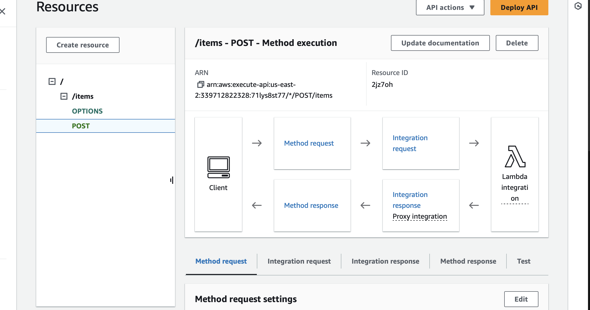
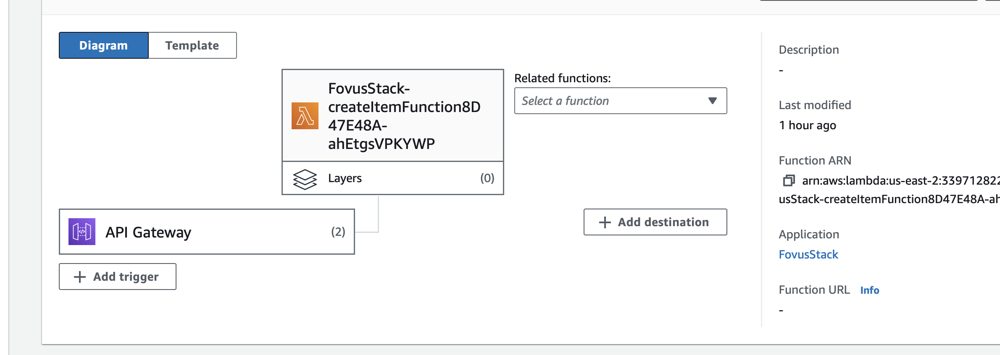
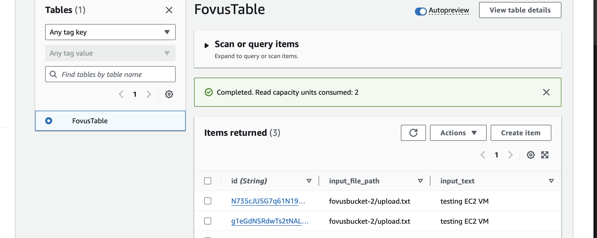

# Fovus Challenge

# Points Completed
1) Front end hosted on Amplify

2) S3 bucket direct upload->API Gateway+Lambda Dynamo db update-> EC2 Instance Creation on Dynamo DB event

## Pending points
1) Getting the EC2 instances to run script. 
2) Environment variables and cleaning code. Amplify env variables and Cognito.
3) Prettifying Front end

